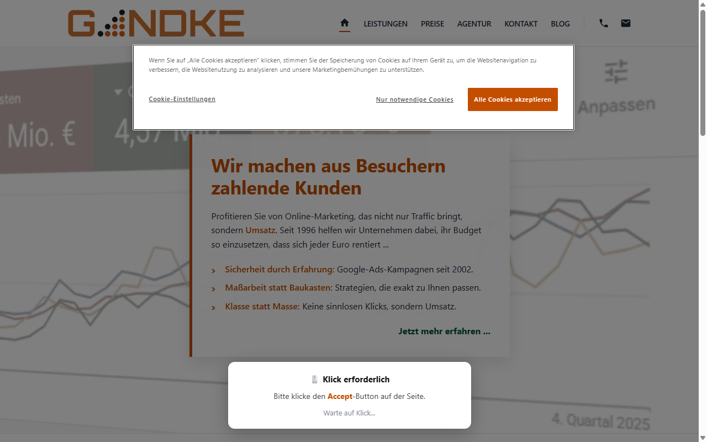
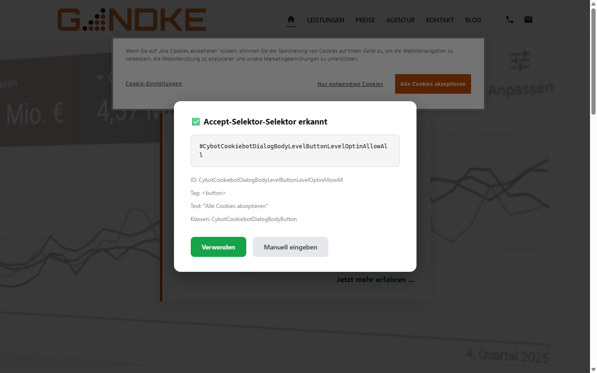
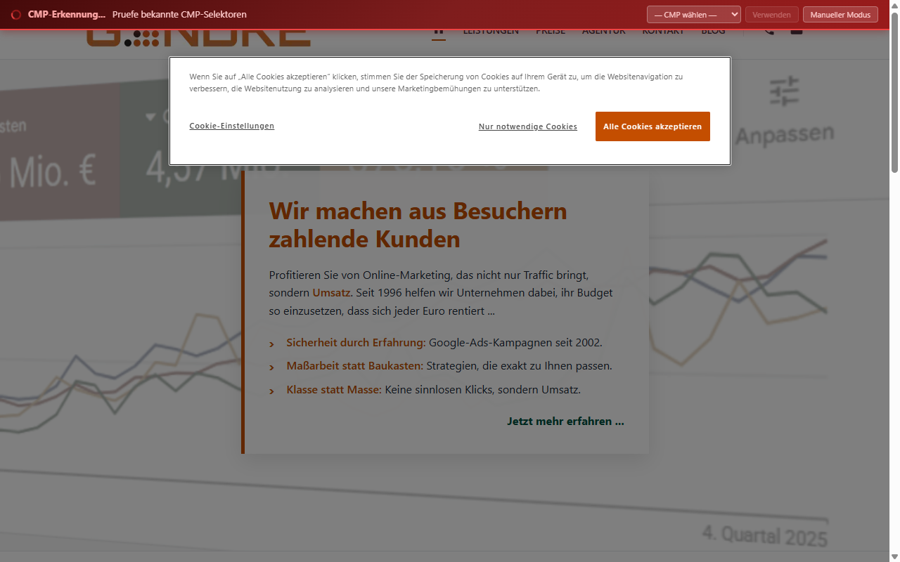
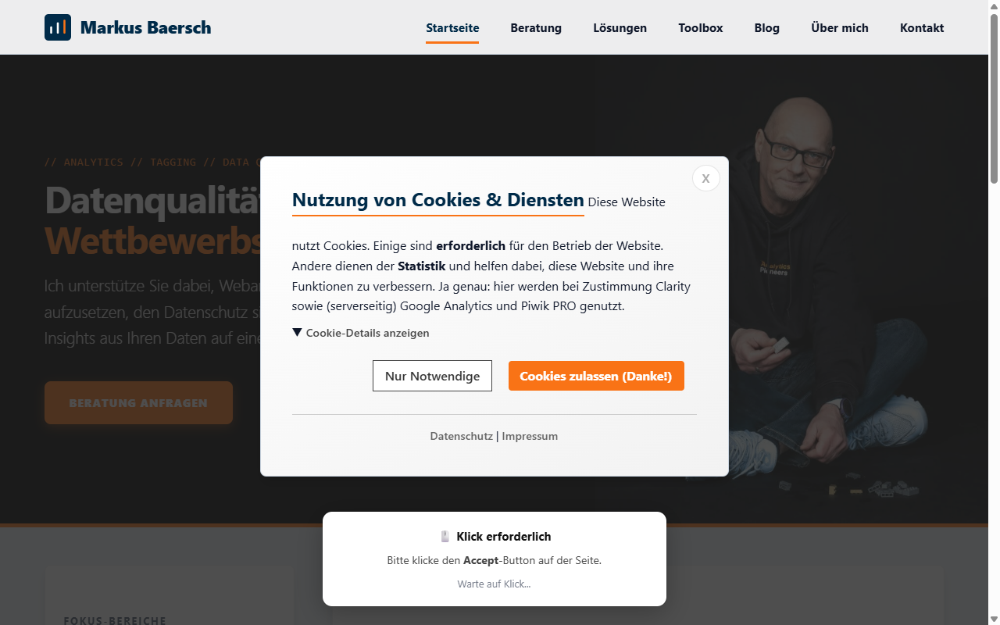
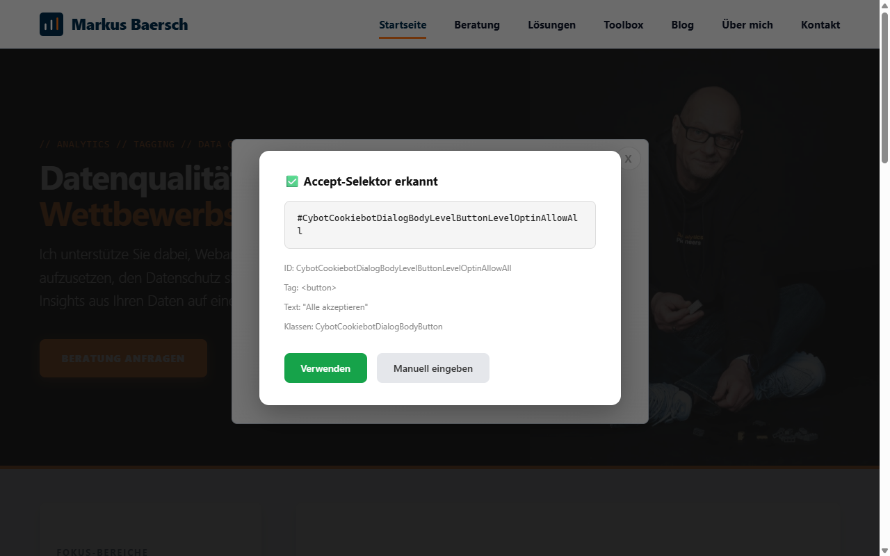
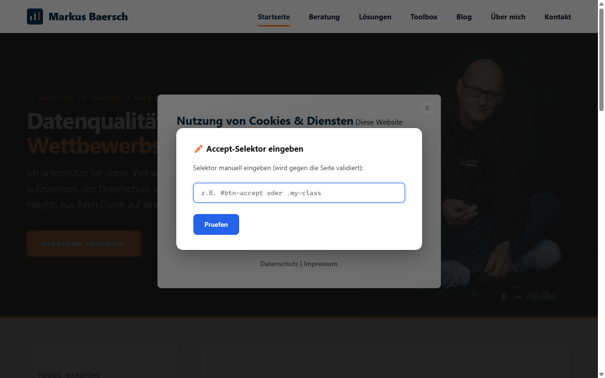
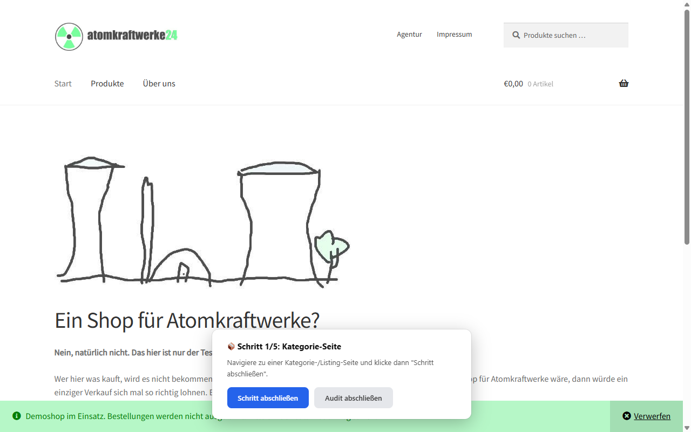
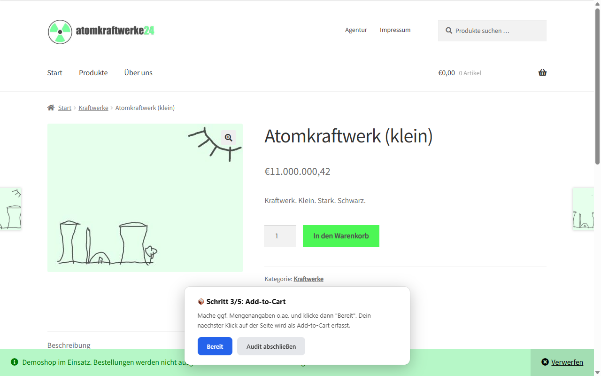
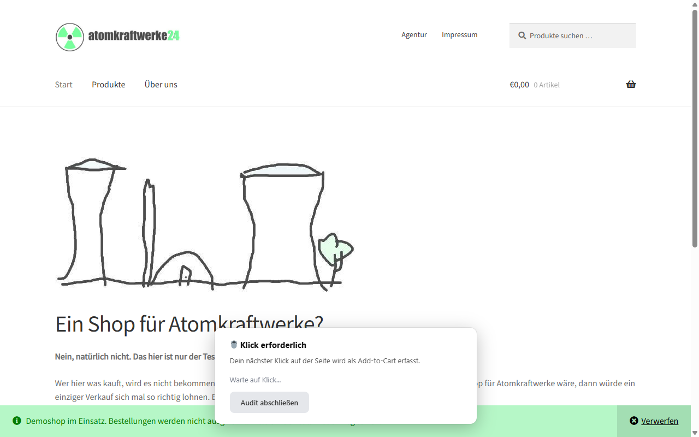

# Tracking Auditor

Node.js-Toolkit zur automatisierten Analyse von Tracking-Setups auf Websites. Erfasst dataLayer-Events, Netzwerk-Requests, Cookies und localStorage in verschiedenen Consent-Zustaenden und generiert strukturierte Markdown-Reports.

## Voraussetzungen

- **Node.js** (ES Modules)
- **Playwright** mit Chromium

```bash
npm install
npx playwright install chromium
```

## Aufbau

```
audit.js          Automatisierter Audit-Runner (Consent + E-Commerce)
compare.js        Tracking-Vergleich zwischen zwei URLs (Live vs. Staging)
learn.js          CMP-Selektoren einsammeln und in cmp-library.json speichern
browser-ui.js     Browser-Overlay-Komponenten (Dialoge, Status Bar, Click-Prompts)
cmp-library.json  Datenbank bekannter CMP-Selektoren (accept/reject, ~40 CMPs)
tracking-vendors.json  Datenbank bekannter Tracking-Produkte (Scripts, Endpoints, Domains)
reports/          Ablageort fuer generierte Reports (lokal, nicht im Repo)
```

## Verwendung

### 1. CMP einlernen

Bevor ein Audit laeuft, muss die Consent Management Platform (CMP) der Zielseite bekannt sein. `learn.js` oeffnet einen sichtbaren Browser und erkennt die Accept/Reject-Selektoren interaktiv:

```bash
# Nur URL ist Pflicht -- CMP-Name wird am Ende abgefragt
node learn.js --url https://example.com

# CMP-Name kann auch direkt angegeben werden
node learn.js --url https://example.com --cmp "Usercentrics"
```

**Ablauf:**



1. Browser oeffnet die URL
2. Ein Overlay am unteren Rand zeigt Anweisungen -- du klickst den Accept-Button auf der Seite
3. Das Script erkennt den Selektor automatisch und zeigt ihn zur Bestaetigung an


4. Bei Shadow DOM CMPs: schwebende Hint-Card (kein Overlay) -- Seite bleibt fuer DevTools zugaenglich, Selektor wird manuell eingegeben und live validiert
5. Browser-Neustart, dann Reject-Button. Bei Shadow DOM wird interaktiv gefragt, ob der Reject-Button direkt sichtbar ist oder ein Zwischenschritt noetig ist (Two-Step)
6. **Library-Matching:** Gelernte Selektoren werden gegen bestehende Eintraege geprueft -- bei Match kann der existierende Eintrag wiederverwendet werden
7. **Detect-Selektoren:** Automatischer Vorschlag von Container-IDs (z.B. `#usercentrics-root`) aus der DOM-Umgebung des Accept-Buttons, mit Bestaetigung/Anpassung/Skip
8. CMP-Name abfragen (falls nicht via `--cmp` angegeben)
9. Alle Selektoren werden in `cmp-library.json` gespeichert

Die Interaktion findet komplett im Browser-Overlay statt. Mit `--terminal` kann auf den alten readline-Modus gewechselt werden.

### 2. Audit durchfuehren

**Nur Consent-Check:**

```bash
node audit.js --url https://example.com --project mein-projekt
```

**E-Commerce automatisch (URLs/Selektoren vorab bekannt):**

```bash
node audit.js \
  --url https://example.com \
  --project mein-projekt \
  --category /kategorie/schuhe \
  --product /produkt/sneaker-xyz \
  --add-to-cart ".add-to-cart-btn" \
  --view-cart /warenkorb \
  --checkout /kasse
```

**E-Commerce interaktiv (ohne Vorbereitung):**

```bash
node audit.js --url https://example.com --project mein-projekt --ecom
```

Im interaktiven Modus navigierst du selbst durch den Shop. Eine schwebende Card fuehrt durch 5 Schritte (Kategorie, PDP, Add-to-Cart, Warenkorb, Checkout). Jeder Schritt ist per "Audit abschliessen" ueberspringbar -- es wird ausgewertet was erhoben wurde.

### Parameter

| Parameter | Pflicht | Beschreibung |
|-----------|---------|-------------|
| `--url` | ja | Startseite URL |
| `--project` | ja | Projektname, bestimmt Report-Pfad |
| `--cmp` | nein | CMP-Name, ueberspringt Auto-Erkennung |
| `--disable-sw` | nein | Service Worker deregistrieren |
| `--ecom` | nein | Interaktiver E-Commerce-Modus (manuell navigieren) |
| `--no-payload-analysis` | nein | Deep Analysis deaktivieren (CSP-Violations, Payload-Analyse, Stape-Decode) |
| `--category` | nein | Kategorie-URL (aktiviert automatischen E-Commerce-Pfad) |
| `--product` | nein | Produkt-URL |
| `--add-to-cart` | nein | CSS-Selektor fuer Add-to-Cart-Button |
| `--view-cart` | nein | Warenkorb-URL |
| `--checkout` | nein | Checkout-URL |

## Audit-Phasen

Eine rote Status Bar im Browser zeigt den aktuellen Fortschritt in Echtzeit.



1. **CMP-Erkennung** -- Prueft alle Selektoren aus `cmp-library.json` nach Prioritaet (haeufigste CMPs zuerst). Waehrend der Auto-Erkennung kann per Dropdown eine CMP aus der Liste gewaehlt oder in den manuellen Modus gewechselt werden.
2. **Pre-Consent** -- dataLayer, Third-Party-Requests, Consent Mode (gcs/gcd), Cookies, localStorage, SST-Erkennung
2b. **Deep Analysis** (nach jeder Phase, sofern nicht `--no-payload-analysis`) -- CSP-Violations sammeln (blockierte Tracking-Requests), Stape Custom Loader Transport dekodieren (Base64-codierte Google-URLs), Enhanced Conversions / Dynamic Remarketing / Meta CAPI aus Request-Payloads erkennen
3. **Post-Accept** -- CMP Accept klicken, Diffs gegenueber Pre-Consent erfassen
4. **E-Commerce** (optional) -- Automatisch (`--category`) oder interaktiv (`--ecom`). Pro Schritt: dataLayer + Requests + Consent Mode + Cookie/localStorage-Diff
5. **Post-Reject** -- Komplett neuer Browser, Reject klicken, Diffs erfassen
6. **Report** -- Markdown-Ausgabe nach `reports/<project>/audit-<YYYY-MM-DD-HHMM>.md`

### Manueller Modus

Wenn die CMP-Auto-Erkennung fehlschlaegt oder per Skip-Button uebersprungen wird, aktiviert sich der manuelle Modus:



1. Browser-Overlay fordert zum Klick auf Accept-Button auf
2. Erkannter Selektor wird zur Bestaetigung angezeigt (oder manuelle Eingabe)




3. Seite wird neu geladen fuer den Reject-Button
4. Selektoren werden gegen die Library abgeglichen -- bei Match kann das bestehende CMP verwendet werden
5. Ansonsten: neues CMP benennen und in `cmp-library.json` speichern
6. Audit laeuft mit den neuen Selektoren weiter

Der manuelle Modus wird maximal einmal pro Audit ausgeloest.

## Report-Inhalte

Der generierte Report enthaelt:

- **Zusammenfassung** -- Tracker-Uebersicht ueber alle Consent-Phasen, Consent Mode Status, TL;DR-Einzeiler fuer alle Findings
- **Consent Mode Verification** -- Prueft ob nach Accept ein gcs-Update erfolgt (G100 -> G1xx). Zeigt Advanced vs. Basic Consent Mode Diagnose mit Erklaerung
- **Pre-Consent** -- Tracking vor jeglicher Consent-Entscheidung (Verstoesse sofort erkennbar)
- **Post-Accept / Post-Reject** -- Diffs bei Cookies, localStorage, Requests, dataLayer
- **Server-Side Tagging** -- Erkennung von Custom GTM/gtag-Loadern und First-Party Collect Endpoints
- **E-Commerce-Pfad** -- dataLayer-Events und Tracker pro Schritt (Kategorie bis Checkout), inkl. Consent Mode Status pro Step
- **Produktdaten-Analyse** -- Format-Erkennung (GA4/UA/Proprietary), Konsistenz-Check ueber alle E-Commerce-Schritte, fehlende Events
- **CSP-Blockaden** (nur wenn CSP Tracking-Requests blockiert hat) -- Liste der blockierten Tracker-Domains
- **Tracking Features** (nur wenn Findings vorhanden) -- Enhanced Conversions, Dynamic Remarketing, Meta CAPI, Stape Custom Loader IDs

## Browser-UI

Alle interaktiven Elemente (Dialoge, Click-Prompts, Selektor-Eingabe) werden als Browser-Overlays direkt auf der Zielseite angezeigt:

- **Dialoge** sind per Drag verschiebbar, falls sie CMP-Banner verdecken
- **Click-Prompts** erscheinen als schwebende Card am unteren Rand ohne die Seite zu verdecken
- **E-Commerce-Prompts** fuehren durch die interaktiven Schritte; sie ueberleben Seitennavigation (automatische Re-Injection)
- **Status Bar** zeigt Phase, Fortschritt und CMP-Auswahl-Dropdown waehrend der Erkennung
- CSS ist gegen globale Resets gehaertet (funktioniert auf jeder Seite)

## Interaktiver E-Commerce-Modus

Mit `--ecom` laeuft der E-Commerce-Pfad ohne Vorbereitung. Du navigierst selbst, das Tool sammelt die Daten:



| Schritt | Typ | Ablauf |
|---------|-----|--------|
| Kategorie-Seite | Navigate | Zur Kategorieseite surfen, "Schritt abschliessen" klicken |
| Produkt-Seite | Navigate | Zur PDP surfen, "Schritt abschliessen" klicken |
| Add-to-Cart | Click | "Bereit" klicken, dann den Warenkorb-Button auf der Seite -- der Klick wird automatisch erkannt |
| Warenkorb | Navigate | Zum Warenkorb surfen, "Schritt abschliessen" klicken |
| Checkout | Navigate | Zum Checkout surfen, "Schritt abschliessen" klicken |





**Add-to-Cart Besonderheiten:**
- Nach "Bereit" startet der Request-Collector und ein dataLayer-Monkey-Patch
- Der naechste Klick auf der Seite wird automatisch als Add-to-Cart erkannt
- Falls der Klick eine Navigation ausloest (z.B. Redirect zum Warenkorb), werden dataLayer-Events von _beiden_ Seiten erfasst: die Events vor der Navigation (per Monkey-Patch + `exposeFunction`) und die Events auf der neuen Seite

Jeder Schritt ist per "Audit abschliessen" ueberspringbar. Der Report enthaelt nur die Schritte, die tatsaechlich durchlaufen wurden.

## Tracking-Vergleich (compare.js)

Vergleicht Tracking-Setups zwischen zwei URLs (z.B. Live vs. Staging, Standard-GTM vs. sGTM Custom Loader):

```bash
node compare.js --url-a https://example.com/ --url-b https://example.com/staging --project example_com \
  --label-a "Live" --label-b "sGTM Staging"
```

| Parameter | Pflicht | Default | Beschreibung |
|-----------|---------|---------|--------------|
| `--url-a` | ja | - | Erste URL (Referenz/Live) |
| `--url-b` | ja | - | Zweite URL (Staging/Test) |
| `--project` | ja | - | Projektname |
| `--label-a` | nein | Host A | Anzeigename Seite A |
| `--label-b` | nein | Host B | Anzeigename Seite B |
| `--post-consent-wait` | nein | 5000 | Wartezeit nach Consent (ms) |

Der Browser oeffnet sich sequenziell (erst Seite A, dann Seite B) mit isolierten Kontexten. Der Consent-Button ist anfangs deaktiviert und wird erst nach dem load-Event + 3 Sekunden freigeschaltet, um saubere Pre-/Post-Consent-Trennung sicherzustellen. Consent wird manuell per Floating Card bestaetigt. Der Report enthaelt einen **Consent Mode Vergleich** (Advanced vs. Basic, gcs/gcd-Flags pre- und post-consent). Output: Markdown-Report + 2 HAR-Files in `reports/<project>/`.

## Tracking-Vendor-Library (`tracking-vendors.json`)

Zentrale Datenbank bekannter Tracking-Produkte -- analog zur `cmp-library.json` fuer CMPs. Wird von `audit.js` und `compare.js` automatisch geladen.

### Inhalt

Jeder Eintrag beschreibt ein Tracking-Produkt mit:

- **vendor / product / category** -- z.B. "Google" / "Google Analytics 4" / "analytics"
- **scripts** -- URL-Patterns fuer eingehende Script-Loads (z.B. `googletagmanager.com/gtag/js` mit `?id=G-*`)
- **endpoints** -- URL-Patterns fuer ausgehende Tracking-Requests (z.B. `google-analytics.com/g/collect`) mit optionaler Request-Typ-Klassifizierung (pageview, event, conversion)
- **domains** -- Fallback-Domains fuer Zuordnung wenn kein Script/Endpoint-Pattern matcht

Aktuell ~16 Produkte: GA4, Google Ads, Floodlight, Google Tag, GTM, AdSense, Meta Pixel, TikTok Pixel, Pinterest Tag, LinkedIn Insight, Microsoft Ads, Microsoft Clarity, Criteo, Taboola, Outbrain, Hotjar.

### Neuen Vendor hinzufuegen

Neuen JSON-Eintrag mit folgendem Schema anlegen:

```json
"mein-vendor": {
  "vendor": "Vendor Name",
  "product": "Produkt Name",
  "category": "analytics|advertising|retargeting|session-recording|native-ads|tag-management",
  "scripts": [{ "pattern": "domain.com/script.js" }],
  "endpoints": [{ "pattern": "domain.com/collect", "type": "event" }],
  "domains": ["domain.com"]
}
```

### Report-Format

Die Tracker-Tabellen in Reports zeigen jetzt produktgenaue Details:

| Spalte | Beschreibung |
|--------|-------------|
| **Produkt** | Konkretes Tracking-Produkt (z.B. "Google Analytics 4", nicht nur "Google") |
| **Kategorie** | Funktionale Kategorie (analytics, advertising, session-recording, ...) |
| **Richtung** | inbound (Script geladen) oder outbound (Request gesendet) |
| **Typen** | Request-Klassifizierung (pageview, event, conversion, remarketing) |

Nicht erkannte Third-Party-Requests werden weiterhin als "Sonstige Third-Party" gefuehrt.

## Claude Code Skills

Dieses Projekt bringt drei [Claude Code Skills](https://docs.anthropic.com/en/docs/claude-code/skills) mit, die das Toolkit per natuerlicher Sprache nutzbar machen:

### tagging-audit

Startet einen Tracking-Audit. Normalfall: nur die URL angeben, alles andere laeuft automatisch.

```
"Mach einen Tagging-Audit von gandke.de"
"Audit example.com mit E-Commerce"
```

### tracking-compare

Vergleicht Tracking-Setups auf zwei URLs (z.B. Live vs. Staging, Standard-GTM vs. sGTM).

```
"Vergleiche das Tracking auf example.com mit example.com/staging"
"Live vs. sGTM Vergleich fuer elterngeldexperten.de"
```

### cmp-learn

Lernt eine neue CMP ein (Accept/Reject-Selektoren) und speichert sie in der Library.

```
"Lerne die CMP auf example.com ein"
"Lerne die CMP 'Usercentrics' auf example.com ein"
```

Die Skills liegen in `.claude/skills/` und werden von Claude Code automatisch erkannt.

## Hinweise

- Der Browser laeuft immer sichtbar (`headless: false`)
- Der Reject-Durchlauf nutzt einen komplett separaten Browser-Prozess
- Service Worker koennen dazu fuehren, dass Requests nicht erfasst werden (gtag nutzt SW wenn verfuegbar). Mit `--disable-sw` werden sie deregistriert
- Auf Windows mit Git Bash werden relative URL-Pfade (z.B. `/kategorie/`) manchmal zu lokalen Pfaden umgeschrieben. Das Script erkennt und korrigiert das automatisch, alternativ volle URLs verwenden oder `MSYS_NO_PATHCONV=1` setzen
