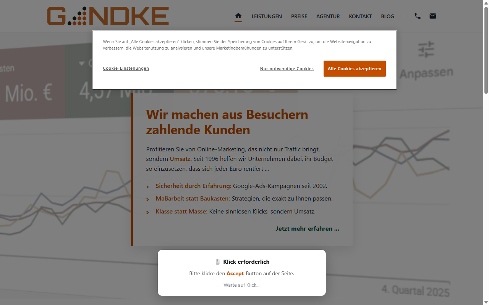
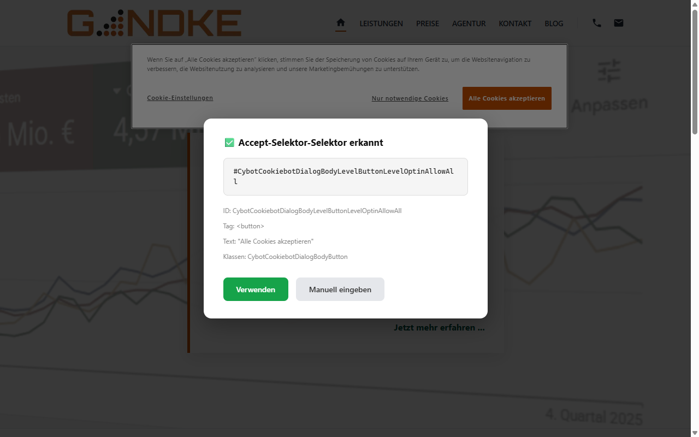
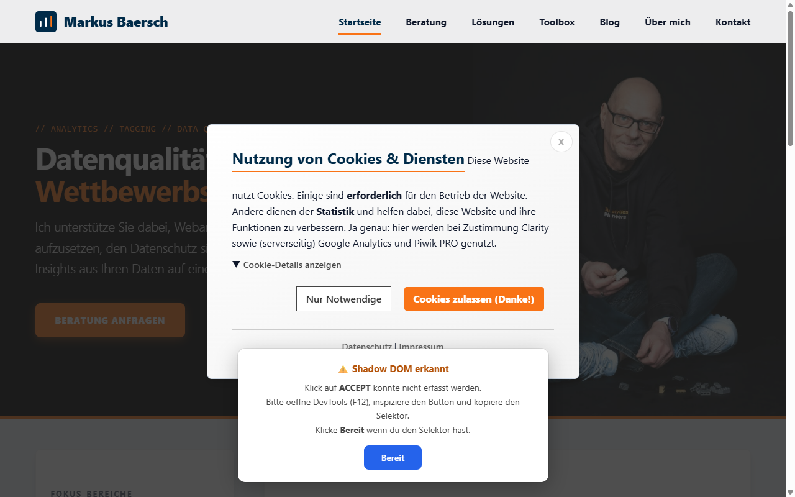
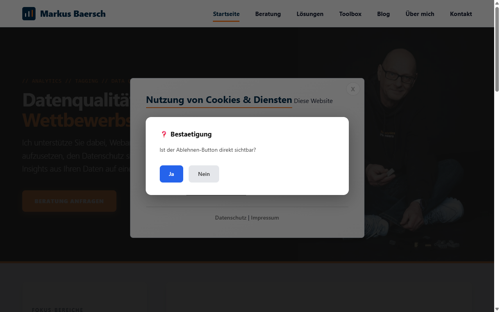
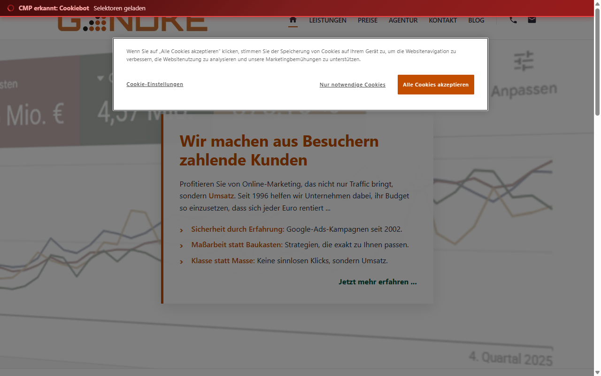
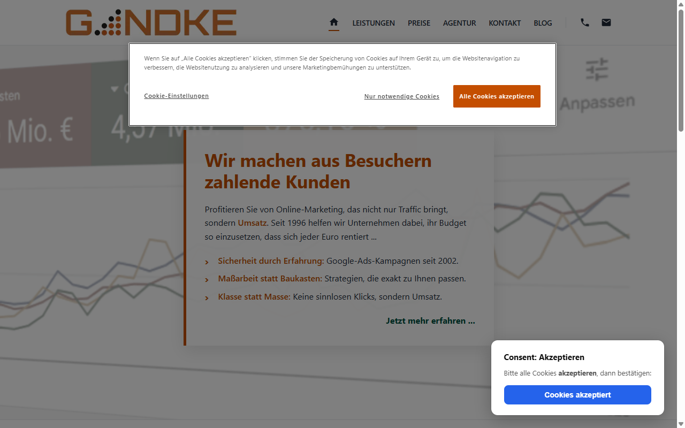
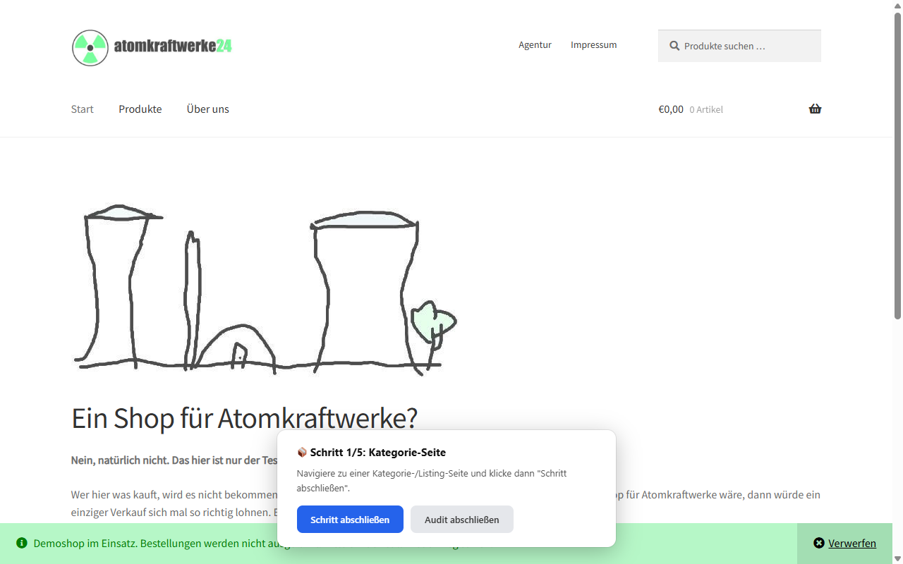
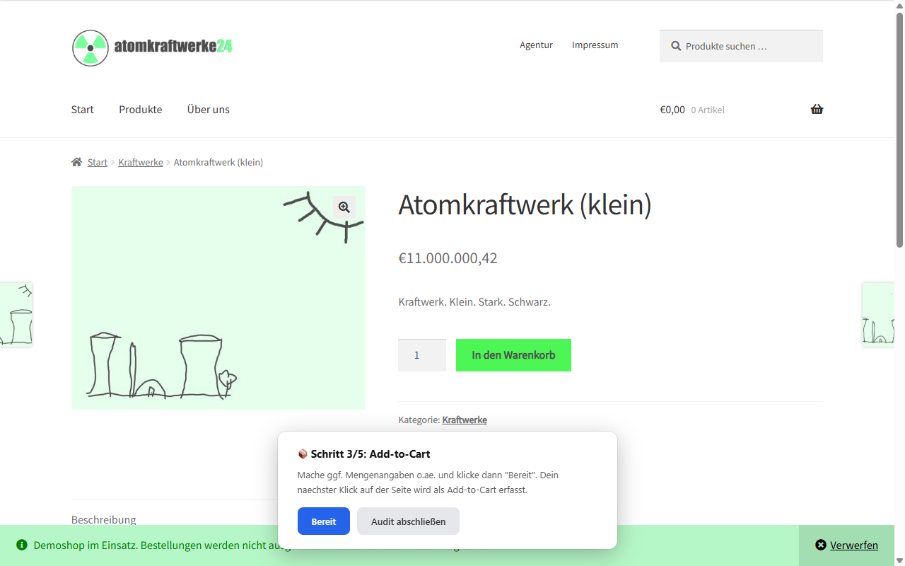
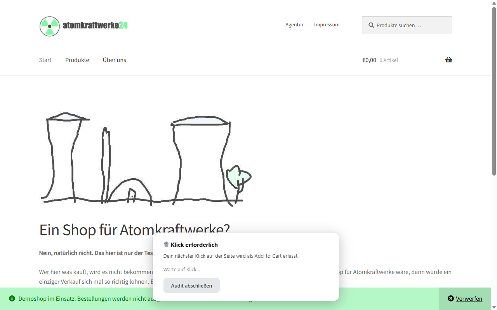
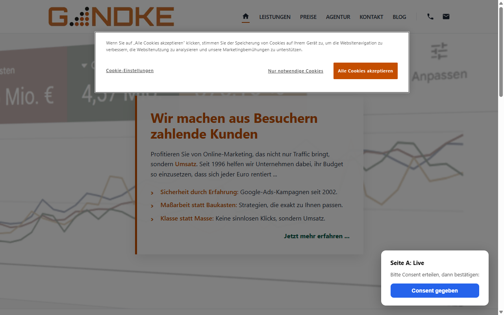

# Tracking Auditor

Node.js-Toolkit zur automatisierten Analyse von Tracking-Setups auf Websites. Erfasst dataLayer-Events, Netzwerk-Requests, Cookies und localStorage in verschiedenen Consent-Zustaenden und generiert strukturierte Markdown-Reports.

Vier Hauptfunktionen:

1. **[CMP einlernen](#1-cmp-einlernen)** -- Consent-Banner-Selektoren interaktiv erfassen und speichern
2. **[Audit durchfuehren](#2-audit-durchfuehren)** -- Tracking-Setup einer Website analysieren (Pre-Consent, Post-Accept, Post-Reject, E-Commerce)
3. **[Tracking-Vergleich](#3-tracking-vergleich-comparejs)** -- Zwei Setups gegeneinander vergleichen (z.B. Live vs. sGTM)
4. **[Asynchroner Flow-Vergleich](#4-asynchroner-flow-vergleich-har-basiert)** -- Einen Checkout-Flow ueber die Zeit vergleichen (Baseline vorher, Delta nachher), inkl. PII-Nachweis pro Vendor

Die CMP-Bibliothek erkennt aktuell **122 Consent-Banner und CMPs** automatisch (Accept/Reject-Selektoren in [`cmp-library.json`](cmp-library.json)) -- siehe [Changelog](#changelog) zum Wachstum.

Beispiel-Reports: [Audit-Report](examples/audit-example-report.md) | [Tracking-Vergleich](examples/compare-example-report.md)


## Voraussetzungen

- **Node.js** (ES Modules)
- **Playwright** mit Chromium

```bash
npm install
npx playwright install chromium
```

## Aufbau

```
audit.js          Automatisierter Audit-Runner (Consent + E-Commerce)
compare.js        Tracking-Vergleich zwischen zwei URLs (Live vs. Staging)
flow-analyze.js   HAR eines Checkout-Flows auswerten -> Snapshot + Report
flow-delta.js     Zwei Flow-Snapshots ueber die Zeit vergleichen (Baseline vs. nachher)
flow-recorder.js  Flow live aufzeichnen (Playwright, Phasen-Overlay) -- Alternative zum HAR-Weg
flow-lib.js       Gemeinsame Analyse-/Report-Logik fuer flow-analyze und flow-recorder
pii-lib/          Vendored PII/Event-Parser (Snapshot aus der Tracking-Auditor-Extension)
learn.js          CMP-Selektoren einsammeln und in cmp-library.json speichern
browser-ui.js     Browser-Overlay-Komponenten (Dialoge, Status Bar, Click-Prompts)
cmp-library.json  Datenbank bekannter CMP-Selektoren (accept/reject, ~122 CMPs)
tracking-vendors.json  Datenbank bekannter Tracking-Produkte (Scripts, Endpoints, Domains)
reports/          Ablageort fuer generierte Reports (lokal, nicht im Repo)
```

## Verwendung

### 1. CMP einlernen

Bevor ein Audit laeuft, muss die Consent Management Platform (CMP) der Zielseite bekannt sein. `learn.js` oeffnet einen sichtbaren Browser und erkennt die Accept/Reject-Selektoren interaktiv:

```bash
# Nur URL ist Pflicht -- CMP-Name wird am Ende abgefragt
node learn.js --url https://example.com

# CMP-Name kann auch direkt angegeben werden
node learn.js --url https://example.com --cmp "Usercentrics"
```

**Ablauf:**



1. Browser oeffnet die URL
2. Ein Overlay am unteren Rand zeigt Anweisungen -- du klickst den Accept-Button auf der Seite
3. Das Script erkennt den Selektor automatisch und zeigt ihn zur Bestaetigung an


4. Bei Shadow DOM CMPs: schwebende Hint-Card (kein Overlay) -- Seite bleibt fuer DevTools zugaenglich, Selektor wird manuell eingegeben und live validiert


5. Browser-Neustart, dann Reject-Button. Bei Shadow DOM wird interaktiv gefragt, ob der Reject-Button direkt sichtbar ist oder ein Zwischenschritt noetig ist (Two-Step)


6. **Library-Matching:** Gelernte Selektoren werden gegen bestehende Eintraege geprueft -- bei Match kann der existierende Eintrag wiederverwendet werden
7. **Detect-Selektoren:** Automatischer Vorschlag von Container-IDs (z.B. `#usercentrics-root`) aus der DOM-Umgebung des Accept-Buttons, mit Bestaetigung/Anpassung/Skip
8. CMP-Name und Priority abfragen (kombinierter Dialog; Priority 1-9, Default 3 = normal)
9. Alle Selektoren werden in `cmp-library.json` gespeichert

Die Interaktion findet komplett im Browser-Overlay statt. Mit `--terminal` kann auf den alten readline-Modus gewechselt werden.

### 2. Audit durchfuehren

**Nur Consent-Check:**

```bash
node audit.js --url https://example.com --project mein-projekt
```

**E-Commerce automatisch (URLs/Selektoren vorab bekannt):**

```bash
node audit.js \
  --url https://example.com \
  --project mein-projekt \
  --category /kategorie/schuhe \
  --product /produkt/sneaker-xyz \
  --add-to-cart ".add-to-cart-btn" \
  --view-cart /warenkorb \
  --checkout /kasse
```

**E-Commerce interaktiv (ohne Vorbereitung):**

```bash
node audit.js --url https://example.com --project mein-projekt --ecom
```

Im interaktiven Modus navigierst du selbst durch den Shop. Eine schwebende Card fuehrt durch 5 Schritte (Kategorie, PDP, Add-to-Cart, Warenkorb, Checkout). Jeder Schritt ist per "Audit abschliessen" ueberspringbar -- es wird ausgewertet was erhoben wurde.

### Parameter

| Parameter | Pflicht | Beschreibung |
|-----------|---------|-------------|
| `--url` | ja | Startseite URL |
| `--project` | ja | Projektname, bestimmt Report-Pfad |
| `--cmp` | nein | CMP-Name, ueberspringt Auto-Erkennung |
| `--disable-sw` | nein | Service Worker deregistrieren |
| `--ecom` | nein | Interaktiver E-Commerce-Modus (manuell navigieren) |
| `--no-payload-analysis` | nein | Deep Analysis deaktivieren (CSP-Violations, Payload-Analyse, Stape-Decode) |
| `--har` | nein | HAR-Datei mit allen Requests exportieren (neben dem Report) |
| `--category` | nein | Kategorie-URL (aktiviert automatischen E-Commerce-Pfad) |
| `--product` | nein | Produkt-URL |
| `--add-to-cart` | nein | CSS-Selektor fuer Add-to-Cart-Button |
| `--view-cart` | nein | Warenkorb-URL |
| `--checkout` | nein | Checkout-URL |

## Audit-Phasen

Eine rote Status Bar im Browser zeigt den aktuellen Fortschritt in Echtzeit.




1. **CMP-Erkennung** -- Zweistufig: Erst ein schneller Parallel-Check aller Selektoren (alle CMPs gleichzeitig, ohne Wartezeit), dann nur bei Bedarf ein langsamerer sequenzieller Durchlauf mit Timeout pro CMP. Waehrend der Auto-Erkennung kann per Dropdown eine CMP aus der Liste gewaehlt oder in den manuellen Modus gewechselt werden.
2. **Pre-Consent** -- dataLayer, Third-Party-Requests, Consent Mode (gcs/gcd), Cookies, localStorage, SST-Erkennung
2b. **Deep Analysis** (nach jeder Phase, sofern nicht `--no-payload-analysis`) -- CSP-Violations sammeln (blockierte Tracking-Requests), Stape Custom Loader Transport dekodieren (Base64-codierte Google-URLs), TAGGRS Custom Loader Transport erkennen (AES-verschluesselter Envelope -- nur Existenznachweis, keine Entschluesselung), Enhanced Conversions / Dynamic Remarketing / Meta CAPI aus Request-Payloads erkennen
3. **Post-Accept** -- CMP Accept klicken, Diffs gegenueber Pre-Consent erfassen
4. **E-Commerce** (optional) -- Automatisch (`--category`) oder interaktiv (`--ecom`). Pro Schritt: dataLayer + Requests + Consent Mode + Cookie/localStorage-Diff
5. **Post-Reject** -- Komplett neuer Browser, Reject klicken, Diffs erfassen
6. **Report** -- Markdown-Ausgabe nach `reports/<project>/audit-<YYYY-MM-DD-HHMM>.md`

### Manueller Modus

Wenn die CMP-Auto-Erkennung fehlschlaegt oder per Skip-Button uebersprungen wird, erscheint eine Consent Card:



Die Card fordert zum manuellen Akzeptieren/Ablehnen auf der Seite auf. Nach dem Klick auf den CMP-Button wird per "Cookies akzeptiert" bestaetigt und der Audit laeuft weiter. Es findet kein CMP-Lernprozess statt -- dafuer gibt es `learn.js`.

## Report-Inhalte

Der generierte Report enthaelt:

- **Zusammenfassung** -- Tracker-Uebersicht ueber alle Consent-Phasen, Consent Mode Status, TL;DR-Einzeiler fuer alle Findings
- **Consent Mode Verification** -- Prueft ob nach Accept ein gcs-Update erfolgt (G100 -> G1xx). Zeigt Advanced vs. Basic Consent Mode Diagnose mit Erklaerung
- **Pre-Consent** -- Tracking vor jeglicher Consent-Entscheidung (Verstoesse sofort erkennbar)
- **Post-Accept / Post-Reject** -- Diffs bei Cookies, localStorage, Requests, dataLayer
- **Server-Side Tagging** -- Erkennung von Custom GTM/gtag-Loadern und First-Party Collect Endpoints. Base64-getunnelte Hits (Stape Custom Loader) werden dekodiert und dem korrekten Produkt zugeordnet (GA4, Google Ads, Floodlight) -- in den Tracker-Tabellen als Richtung `sst-tunnel`. Verschluesselt getunnelte Transporte (**TAGGRS** Custom Loader) werden am Envelope-Fingerprint **erkannt** (Existenznachweis im SST-Abschnitt), aber nicht entschluesselt -- Detail-Parameter wie Events, IDs oder Consent-Mode-Status bleiben verborgen
- **E-Commerce-Pfad** -- dataLayer-Events und Tracker pro Schritt (Kategorie bis Checkout), inkl. Consent Mode Status pro Step
- **Produktdaten-Analyse** -- Format-Erkennung (GA4/UA/Proprietary), Konsistenz-Check ueber alle E-Commerce-Schritte, fehlende Events
- **CSP-Blockaden** (nur wenn CSP Tracking-Requests blockiert hat) -- Liste der blockierten Tracker-Domains
- **Tracking Features** (nur wenn Findings vorhanden) -- Enhanced Conversions, Dynamic Remarketing, Meta CAPI, Stape Custom Loader IDs
- **OpenAI Ads Pixel** (nur wenn ein Pixel gefunden wurde) -- eigener Abschnitt, weil das Pixel seine Events im POST-Body batcht und dabei mehr ueber sich verraet als andere: Pixel-ID, Events je Consent-Phase (mit Betrag in Minor Units korrekt umgerechnet), der vom Pixel selbst gemeldete Consent-Zustand, die vom SDK **verworfenen** Events samt Grund sowie die User-Daten aufgeschluesselt nach Herkunft -- also ob die Website einen Identifier bewusst uebergeben oder das SDK ihn per Automatic Advanced Matching selbst von der Seite gelesen hat

Beispiel-Report: [Audit-Report](examples/audit-example-report.md)

## Browser-UI

Alle interaktiven Elemente (Dialoge, Click-Prompts, Selektor-Eingabe) werden als Browser-Overlays direkt auf der Zielseite angezeigt:

- **Dialoge** sind per Drag verschiebbar, falls sie CMP-Banner verdecken
- **Click-Prompts** erscheinen als schwebende Card am unteren Rand ohne die Seite zu verdecken
- **E-Commerce-Prompts** fuehren durch die interaktiven Schritte; sie ueberleben Seitennavigation (automatische Re-Injection)
- **Status Bar** zeigt Phase, Fortschritt und CMP-Auswahl-Dropdown waehrend der Erkennung
- CSS ist gegen globale Resets gehaertet (funktioniert auf jeder Seite)

## Interaktiver E-Commerce-Modus

Mit `--ecom` laeuft der E-Commerce-Pfad ohne Vorbereitung. Du navigierst selbst, das Tool sammelt die Daten:



| Schritt | Typ | Ablauf |
|---------|-----|--------|
| Kategorie-Seite | Navigate | Zur Kategorieseite surfen, "Schritt abschliessen" klicken |
| Produkt-Seite | Navigate | Zur PDP surfen, "Schritt abschliessen" klicken |
| Add-to-Cart | Click | "Bereit" klicken, dann den Warenkorb-Button auf der Seite -- der Klick wird automatisch erkannt |
| Warenkorb | Navigate | Zum Warenkorb surfen, "Schritt abschliessen" klicken |
| Checkout | Navigate | Zum Checkout surfen, "Schritt abschliessen" klicken |





**Add-to-Cart Besonderheiten:**
- Nach "Bereit" startet der Request-Collector und ein dataLayer-Monkey-Patch
- Der naechste Klick auf der Seite wird automatisch als Add-to-Cart erkannt
- Falls der Klick eine Navigation ausloest (z.B. Redirect zum Warenkorb), werden dataLayer-Events von _beiden_ Seiten erfasst: die Events vor der Navigation (per Monkey-Patch + `exposeFunction`) und die Events auf der neuen Seite

Jeder Schritt ist per "Audit abschliessen" ueberspringbar. Der Report enthaelt nur die Schritte, die tatsaechlich durchlaufen wurden.

### 3. Tracking-Vergleich (compare.js)

Vergleicht Tracking-Setups zwischen zwei URLs (z.B. Live vs. Staging, Standard-GTM vs. sGTM Custom Loader):

```bash
node compare.js --url-a https://example.com/ --url-b https://example.com/staging --project example_com \
  --label-a "Live" --label-b "sGTM Staging"
```

| Parameter | Pflicht | Default | Beschreibung |
|-----------|---------|---------|--------------|
| `--url-a` | ja | - | Erste URL (Referenz/Live) |
| `--url-b` | ja | - | Zweite URL (Staging/Test) |
| `--project` | ja | - | Projektname |
| `--label-a` | nein | Host A | Anzeigename Seite A |
| `--label-b` | nein | Host B | Anzeigename Seite B |
| `--post-consent-wait` | nein | 5000 | Wartezeit nach Consent (ms) |



Der Browser oeffnet sich sequenziell (erst Seite A, dann Seite B) mit isolierten Kontexten. Der Consent-Button ist anfangs deaktiviert und wird erst nach dem load-Event + 3 Sekunden freigeschaltet, um saubere Pre-/Post-Consent-Trennung sicherzustellen. Consent wird manuell per Floating Card bestaetigt. Der Report enthaelt einen **Consent Mode Vergleich** (Advanced vs. Basic, gcs/gcd-Flags pre- und post-consent). Output: Markdown-Report + 2 HAR-Files in `reports/<project>/`.

Beispiel-Report: [Tracking-Vergleich](examples/compare-example-report.md)

### 4. Asynchroner Flow-Vergleich (HAR-basiert)

Waehrend `compare.js` zwei URLs **synchron in einem Lauf** vergleicht, dient der Flow-Vergleich dem **Vorher/Nachher ueber die Zeit** (z.B. GTM-/Consent-/Server-Side-Umstellung): Baseline jetzt aufzeichnen, nach der Umstellung erneut, dann das Delta bestimmen. Der Schwerpunkt liegt auf einem **mehrstufigen Checkout-Flow** (Startseite -> Produkt -> Warenkorb -> Checkout -> Adresse) und dem **Nachweis, welche personenbezogenen Felder (E-Mail, Telefon, Name, Adresse) an welchen Vendor** gehen -- inklusive gehashter Formen (Meta/TikTok Advanced Matching, GA4/Ads Enhanced Conversions).

Die PII-/Event-Erkennung nutzt die vendored Parser unter `pii-lib/` (Snapshot aus der separaten Tracking-Auditor-Browser-Extension). Abgedeckt sind 16 Dienste: GA4, Meta, Microsoft UET, TikTok, Pinterest, Google Ads, Floodlight, LinkedIn, Reddit, Snapchat, HubSpot, Criteo, Taboola, Outbrain, Awin, OpenAI -- damit derselbe Umfang wie im DevTools-Panel der Extension. Dienste ohne dedizierten Parser (GTM, Google Tag, AdSense, Clarity, Hotjar) werden ueber `tracking-vendors.json` als Praesenz erkannt.

Vier Parser (GA4, Meta, Google Ads, UET) bekommen zusaetzlich die URL der auditierten Seite und erkennen damit **First-Party-Transporte per eTLD+1-Vergleich**. Ohne diese Angabe kann kein Request als `first-party` gelten -- eine Klassifikation nach blosser URL-Form wuerde sonst Google-eigene Hosts wie `stats.g.doubleclick.net` faelschlich als eigenes Setup ausweisen.

Ein einzelner Request kann dabei **mehrere Events** liefern: das OpenAI-Pixel buendelt mehrere Events in einen POST. Jedes Event wird einzeln ausgewertet, damit im Batch mitgeschickte Identifier nicht verloren gehen.

**Empfohlener Weg -- HAR selbst aufnehmen und auswerten:**

```bash
# 1) HAR im eigenen Browser aufnehmen: DevTools -> Network -> "Preserve log" AN
#    -> Funnel durchklicken (bis Adresseingabe, kein Kaufabschluss)
#    -> "Save all as HAR with content"
# 2) Auswerten -> Snapshot + Report
node flow-analyze.js --har pfad/zur/baseline.har --project example_com --label baseline --url https://example.com/

# 3) Nach der Umstellung dasselbe erneut
node flow-analyze.js --har pfad/zur/nachher.har --project example_com --label post-change --url https://example.com/

# 4) Delta zwischen beiden Snapshots
node flow-delta.js \
  --baseline reports/example_com/flow-example_com-baseline-<ts>-snapshot.json \
  --current  reports/example_com/flow-example_com-post-change-<ts>-snapshot.json \
  --project example_com
```

| Tool | Parameter | Pflicht | Beschreibung |
|------|-----------|---------|--------------|
| `flow-analyze.js` | `--har` | ja | Pfad zur HAR-Datei (DevTools-Export) |
| | `--project` | ja | Projektname (Report-Pfad) |
| | `--label` | ja | Lauf-Label, z.B. `baseline` / `post-change` |
| | `--url` | nein | Shop-Start-URL (bestimmt First-Party-Domain; sonst aus HAR ermittelt) |
| `flow-delta.js` | `--baseline` | ja | Snapshot-JSON des Vorher-Laufs |
| | `--current` | ja | Snapshot-JSON des Nachher-Laufs |
| | `--project` | ja | Projektname (Report-Pfad) |
| `flow-recorder.js` | `--url` / `--project` / `--label` | ja | Live-Aufnahme statt HAR (Phasen-Overlay im Browser) |
| | `--headless` | nein | Ohne sichtbaren Browser (Default: sichtbar) |

**Ausgabe je Lauf:** `flow-<host>-<label>-<ts>-snapshot.json` (delta-freundliche Analyse, dauerhafte Grundlage fuer `flow-delta.js`), ein `-report.md` (Einzelreport) und das HAR. Der Delta-Report hebt neue/entfallene Tracker, **PII-Aenderungen pro Vendor**, Consent-Signale (`gcs`-Verteilung, G100-Pings) sowie Container-/Server-Side-Wechsel hervor.

**Zur Consent-Einordnung:** Ein Request-Snapshot kann Basic vs. Advanced Consent Mode **nicht** sicher bestimmen -- das ist eine zeitliche Frage (feuern Pings vor der Consent-Interaktion?). Die Reports melden daher nur Fakten (`gcs`-Werte, Zahl der G100-Pings), kein Verdict. Fuer eine echte Basic/Advanced-Beurteilung den Flow ab Erstaufruf inkl. Consent-Interaktion aufnehmen (z.B. mit `flow-recorder.js`).

## Tracking-Vendor-Library (`tracking-vendors.json`)

Zentrale Datenbank bekannter Tracking-Produkte -- analog zur `cmp-library.json` fuer CMPs. Wird von `audit.js`, `compare.js` und den `flow-*`-Tools automatisch geladen.

> Viele Endpunkt-Signaturen sowie der PII-/Event-Parser (`pii-lib/`) stammen aus der [Tracking Auditor Browser-Extension](https://www.markus-baersch.de/tracking-auditor-extension.html) -- dem Schwesterprojekt, das dieselben Requests live im DevTools-Panel erkennt und aufschluesselt (inkl. Stape-/TAGGRS-Transport-Decode). Neue Vendor-Signaturen aus der Extension werden hierher destilliert.

### Inhalt

Jeder Eintrag beschreibt ein Tracking-Produkt mit:

- **vendor / product / category** -- z.B. "Google" / "Google Analytics 4" / "analytics"
- **scripts** -- URL-Patterns fuer eingehende Script-Loads (z.B. `googletagmanager.com/gtag/js` mit `?id=G-*`)
- **endpoints** -- URL-Patterns fuer ausgehende Tracking-Requests (z.B. `google-analytics.com/g/collect`) mit optionaler Request-Typ-Klassifizierung (pageview, event, conversion)
- **domains** -- Fallback-Domains fuer Zuordnung wenn kein Script/Endpoint-Pattern matcht

Aktuell 21 Produkte: GA4, Google Ads, Floodlight, Google Tag, GTM, AdSense, Meta Pixel, TikTok Pixel, Pinterest Tag, LinkedIn Insight, Microsoft Ads, Microsoft Clarity, Criteo, Taboola, Outbrain, Hotjar, HubSpot, Awin, Reddit Pixel, Snapchat Pixel, OpenAI Ads Pixel.

### Neuen Vendor hinzufuegen

Neuen JSON-Eintrag mit folgendem Schema anlegen:

```json
"mein-vendor": {
  "vendor": "Vendor Name",
  "product": "Produkt Name",
  "category": "analytics|advertising|retargeting|session-recording|native-ads|tag-management|marketing-automation",
  "scripts": [{ "pattern": "domain.com/script.js" }],
  "endpoints": [{ "pattern": "domain.com/collect", "type": "event" }],
  "domains": ["domain.com"]
}
```

### Report-Format

Die Tracker-Tabellen in Reports zeigen produktgenaue Details:

| Spalte | Beschreibung |
|--------|-------------|
| **Produkt** | Konkretes Tracking-Produkt (z.B. "Google Analytics 4", nicht nur "Google") |
| **Kategorie** | Funktionale Kategorie (analytics, advertising, session-recording, ...) |
| **Richtung** | `script` (geladen), `request`/`domain` (direkt gesendet) oder `sst-tunnel` (First-Party getunnelt via Stape Custom Loader) |
| **Typen** | Request-Klassifizierung (pageview, event, click, conversion, remarketing) |

Nicht erkannte Third-Party-Requests werden als "Sonstige Third-Party" gefuehrt.

## Claude Code Skills

Dieses Projekt bringt vier [Claude Code Skills](https://docs.anthropic.com/en/docs/claude-code/skills) mit, die das Toolkit per natuerlicher Sprache nutzbar machen:

### tagging-audit

Startet einen Tracking-Audit. Normalfall: nur die URL angeben, alles andere laeuft automatisch.

```
"Mach einen Tagging-Audit von somedomain.com"
"Audit example.com mit E-Commerce"
```

### tracking-compare

Vergleicht Tracking-Setups auf zwei URLs (z.B. Live vs. Staging, Standard-GTM vs. sGTM).

```
"Vergleiche das Tracking auf www.example.com mit stagingexample.com"
"Live vs. sGTM Vergleich fuer example.com mit example.com/testpage"
```

### flow-compare

Asynchroner Vorher/Nachher-Vergleich eines Checkout-Flows aus HAR-Dateien, mit PII-Nachweis pro Vendor.

```
"Werte das HAR baseline.har als Flow-Baseline fuer example.com aus"
"Bestimme das Delta zwischen der Baseline und dem Nachher-Lauf fuer example.com"
```

### cmp-learn

Lernt eine neue CMP ein (Accept/Reject-Selektoren) und speichert sie in der Library.

```
"Lerne die CMP auf example.com ein"
"Lerne die CMP 'Usercentrics' auf example.com ein"
```

Die Skills liegen in `.claude/skills/` und werden von Claude Code automatisch erkannt.

## Hinweise

- Der Browser laeuft immer sichtbar (`headless: false`)
- Der Reject-Durchlauf nutzt einen komplett separaten Browser-Prozess
- Service Worker koennen dazu fuehren, dass Requests nicht erfasst werden (gtag nutzt SW wenn verfuegbar). Mit `--disable-sw` werden sie deregistriert
- Auf Windows mit Git Bash werden relative URL-Pfade (z.B. `/kategorie/`) manchmal zu lokalen Pfaden umgeschrieben. Das Script erkennt und korrigiert das automatisch, alternativ volle URLs verwenden oder `MSYS_NO_PATHCONV=1` setzen

## Changelog

### 2026-09-06 -- Parser-Gleichstand mit der Browser-Extension

Die vendored Parser unter `pii-lib/` decken jetzt dieselben 16 Dienste ab wie das DevTools-Panel der Extension. Neu mit PII-/Event-Auswertung im Flow-Vergleich: Floodlight, LinkedIn, Reddit, Snapchat, HubSpot, Criteo, Taboola, Outbrain, Awin. Die sechs vorhandenen Parser waren gedriftet und sind mitgezogen worden.

Dabei fiel eine Fehlklassifikation auf: Die alte First-Party-Erkennung schloss allein aus der URL-Form (`v=2` plus `tid=G-`) auf einen First-Party-Transport und wies deshalb Google-eigene Hosts wie `stats.g.doubleclick.net` oder `pagead2.googlesyndication.com` als eigenes Setup aus. Jetzt entscheidet ein eTLD+1-Vergleich gegen die Seiten-URL.

### 2026-09-06 -- OpenAI Ads Pixel

Das OpenAI-Pixel (`oaiq`) wird erkannt und ausgewertet -- als Praesenz in den Tracker-Tabellen und in einem eigenen Report-Abschnitt. Auswertbar ist mehr als bei anderen Pixeln, weil das SDK ein eigenes Diagnostic-Event mitschickt: es meldet den Consent-Zustand, die Konto-Einstellung fuer Automatic Advanced Matching und die Events, die es selbst **verworfen** hat (samt Grund) -- also Implementierungsfehler, die sonst unsichtbar bleiben, weil zu ihnen gar kein Request existiert.

Zwei Eigenheiten praegen den Abschnitt: Das Pixel ist **Opt-out** (es misst ohne expliziten Widerspruch und kennt weder TCF noch Consent Mode), deshalb traegt jedes Event seine Consent-Phase. Und der `user`-Block ist nach **Herkunft** verschachtelt, weshalb der Report unterscheiden kann, ob die Website einen Identifier uebergeben hat oder das SDK ihn selbst von der Seite gelesen hat.

### 2026-07-16 -- Grosser CMP-Bibliothek-Ausbau: 77 -> 122

Die CMP-Bibliothek wuchs an einem Tag von **77 auf 122** Consent-Banner und CMPs (+45). Ablauf: automatischer Sieblauf ueber eine grosse CMP-Liste, anschliessend ein headful DOM-Harvester mit Klick-Verifikation (nur tatsaechlich klick-verifizierte Selektoren wurden uebernommen). Haertefaelle -- Shadow DOM, iframe-basierte Banner, Two-Step-Reject (Second Layer) und bot-erkannte Seiten -- wurden per Hand nachgezogen. Nebenbei mehrere Fehllabels bereinigt (als eigenstaendige CMPs exportierte Engine-Klone von CCM19, Complianz, Avia, Ezoic, Truendo u.a.).

### davor

- **2026-05** -- 43 verifizierte CMPs (Basis)
- Start -- ~40 CMPs (initiale Library)

## Danke

♥️ Danke: Die Quelle für den Ausbau der CMP Bibliothek des Auditors von 77 auf 122 CMPs und Banner war eine von Joachim Nickel bereitgestellte CMP-Liste aus [exatics](https://www.exatics.de/).
